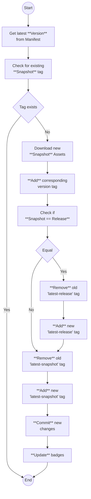

# Minecraft Default Assets
[](https://github.com/Resourcepack-Registry/default/actions/workflows/generate_assets.yml)
[](https://github.com/Resourcepack-Registry/default/tree/latest-release)
[](https://github.com/Resourcepack-Registry/default/tree/latest-snapshot)
[](https://github.com/Resourcepack-Registry/default/compare/latest-release...latest-snapshot)


This repository keeps track of Minecrafts generated default assets for a resourcepack vor every version since version [`rd-132211`](https://minecraft.wiki/w/Java_Edition_pre-Classic_rd-132211). Every 12 hours a check is made to see if there is a new Minecraft version. If a new version is available, it will be published on the `generated` branch with the corresponding tag of the version.

## Structure
Individual files can be accessed by the respective version tag:
```url
https://github.com/Resourcepack-Registry/default/blob/<version>/<path to file>?raw=true
```

Or to view the latest assets, there is a [`latest-release`](https://github.com/Resourcepack-Registry/default/tree/latest-release) and [`latest-snapshot`](https://github.com/Resourcepack-Registry/default/tree/latest-snapshot) tag:
```url
https://github.com/Resourcepack-Registry/default/blob/latest-release/<path to file>?raw=true

https://github.com/Resourcepack-Registry/default/blob/latest-snapshot/<path to file>?raw=true
```

## How it works


## Disclaimer
This repository assumes that because Mojang intentionally provides a public API for downloading the `client.jar`, they have no objection to the resulting generated assets existing anywhere on the internet for public consumption. If this assumption is ever contradicted, the repository will be removed immediately.
