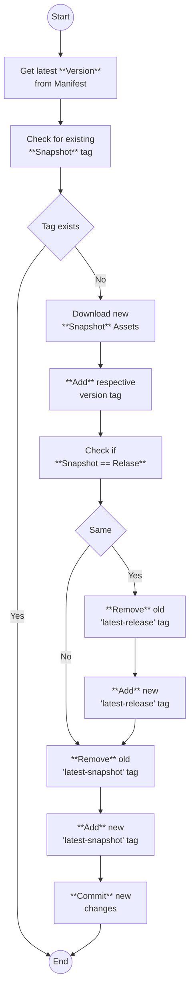

# Minecraft Default Assets
[](https://github.com/Resourcepack-Registry/default/actions/workflows/generate.yml)

This repository keeps track of Minecrafts generated default assets for a resourcepack vor every version. Every 12 hours a check is made to see if there is a new Minecraft version. If a new version is available, it will be published on the `generated` branch with the respective tag of the version.

Individual files can be accessed by the respective version tag:
```url
https://github.com/Resourcepack-Registry/default/blob/<version>/<path to file>?raw=true
```

## How it works

```mermaid

flowchart TD
    START((Start))
    --> 
    A[Get latest **Version**<br>from Manifest]
    --> 
    B[Check for existing<br>**Snapshot** tag]
    -->
    TAG_EXISTS{Tag exists}
    -->
    |No| TAG_EXISTS_NO-A[Download new<br>**Snapshot** Assets]
    -->
    TAG_EXISTS_NO-B[**Add** respective<br>version tag]
    -->
    TAG_EXISTS_NO-C[Check if<br>**Snapshot == Relase**]
    -->
    TAG_EXISTS_NO-SAME{Same}
    -->
    |Yes| TAG_EXISTS_NO-SAME_YES-A[**Remove** old<br>'latest-release' tag]
    -->
    TAG_EXISTS_NO-SAME_YES-B[**Add** new<br>'latest-release' tag]
    
    TAG_EXISTS_NO-SAME
    -->
    |No| TAG_EXISTS_NO-D[**Remove** old<br>'latest-release' tag]
    
    TAG_EXISTS_NO-SAME_YES-B
    -->
    TAG_EXISTS_NO-D

    TAG_EXISTS_NO-D[**Remove** old<br>'latest-snapshot' tag]
    -->
    TAG_EXISTS_NO-E[**Add** new<br>'latest-snapshot' tag]
    -->
    TAG_EXISTS_NO-F[**Commit** new<br>changes]

    TAG_EXISTS
    -->
    |Yes| END

    TAG_EXISTS_NO-F
    -->
    END((End))
```


## Disclaimer
This repository assumes that because Mojang intentionally provides a public API for downloading the `client.jar`, they have no objection to the resulting generated assets existing anywhere on the internet for public consumption. If this assumption is ever contradicted, the repository will be removed immediately.
